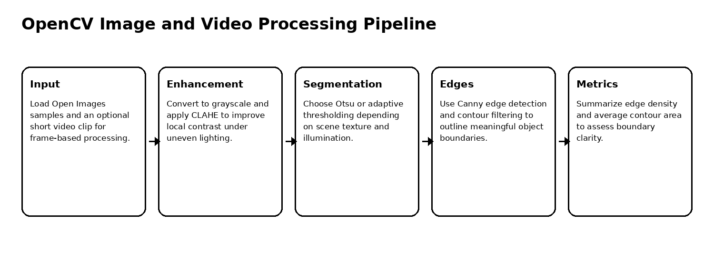
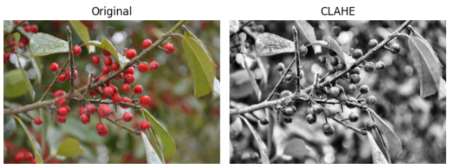
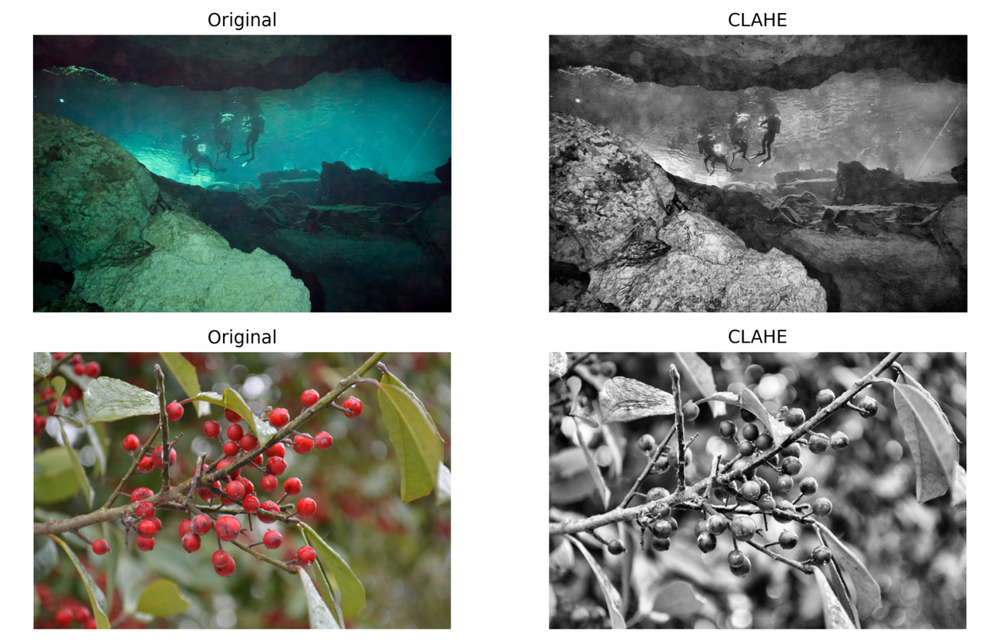
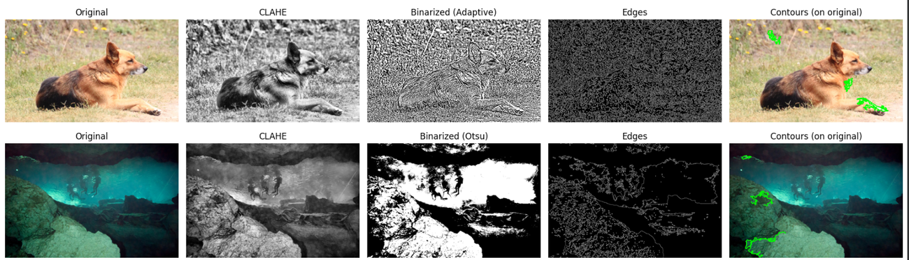
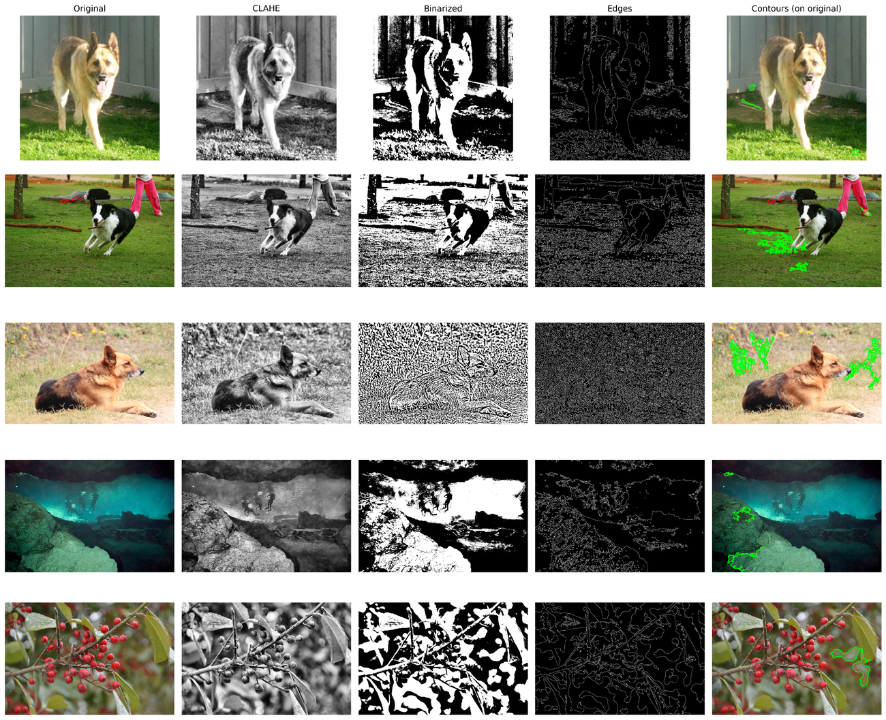
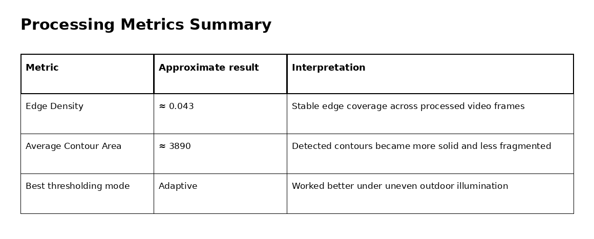

# OpenCV Image Enhancement and Edge Detection

OpenCV image and video preprocessing workflow using CLAHE, thresholding, Canny edge detection, and contour analysis on real-world visual samples.

## Overview

This project explores practical image preprocessing methods that support downstream computer vision tasks such as object detection, segmentation, and boundary extraction. The workflow focuses on enhancing visual structure before detection by improving contrast, separating foreground/background regions, and extracting object boundaries.

The implementation uses OpenCV on a small set of in-the-wild images from Open Images and extends the same processing logic to a short video clip.

## Objective

The goal is to evaluate how classical image processing techniques can improve object boundary visibility in natural scenes that contain uneven lighting, shadows, texture, and background clutter.

## Processing Pipeline



## Methods

| Stage | Method | Purpose |
|---|---|---|
| Grayscale conversion | OpenCV color conversion | Simplifies intensity-based enhancement and thresholding |
| Contrast enhancement | CLAHE | Improves local contrast without overexposing bright regions |
| Binarization | Otsu or Adaptive Thresholding | Separates object structure from background |
| Edge detection | Canny | Extracts thin object boundaries |
| Contour analysis | `findContours` with dynamic filtering | Outlines meaningful shapes and removes small noisy fragments |
| Video processing | Frame-by-frame enhancement and edge extraction | Tests pipeline stability over continuous frames |

## Visual Results

| CLAHE contrast example | Original vs CLAHE comparison |
|---|---|
|  |  |

| Sample processing grid | Multi-sample pipeline outputs |
|---|---|
|  |  |

## Metric Summary



## Key Findings

1. CLAHE improved local contrast in outdoor scenes without excessive brightness distortion.
2. Adaptive thresholding performed better than global Otsu thresholding when lighting varied across the image.
3. Canny edge detection preserved important object boundaries while reducing background noise.
4. Contour filtering helped convert fragmented edges into more interpretable object outlines.
5. The same enhancement and edge pipeline remained useful when applied frame-by-frame to video.
6. Edge density and average contour area provided simple numerical indicators for comparing visual processing quality.

## Repository Contents

```text
.
├── opencv_image_enhancement_edge_detection.ipynb
├── docs/
│   └── figures/
├── requirements.txt
├── .gitignore
└── README.md
```

## Run Locally

This repository is notebook-based. Create a clean Python environment, install the dependencies, then open the notebook.

### Windows PowerShell

```powershell
py -3.10 -m venv .venv
.\.venv\Scripts\Activate.ps1
python -m pip install --upgrade pip
pip install -r requirements.txt
```

### Linux / macOS

```bash
python3 -m venv .venv
source .venv/bin/activate
python -m pip install --upgrade pip
pip install -r requirements.txt
```


## Open the Notebook

```bash
jupyter notebook opencv_image_enhancement_edge_detection.ipynb
```

## Notes

This project focuses on classical computer vision preprocessing rather than end-to-end deep learning detection.
